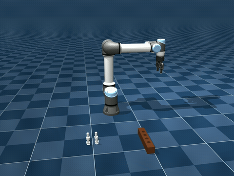

# UR5 Pick-and-Insert Assembly Sim

A MuJoCo simulation of a UR5e arm (with a Robotiq 2F-85 gripper) picking up small
"quick-disconnect" (QD) parts from a tray and screwing each one into its own port on a
manifold — four parts, four ports, one continuous session. No motion-capture ground
truth is used at runtime: the arm finds the parts and the ports the same way a real
camera-guided robot would, by rendering its wrist camera and running plain OpenCV shape
detection on the image.

The whole point of this project for me was the vision-to-motion loop, not just scripting
a canned trajectory — the arm flies to a rough "look here" position, then closes in while
continuously re-detecting the real part/port in the live camera feed, correcting its
target as it descends. It also does the actual screwing motion as a helical
rotate-and-descend (real thread pitch, from the connector's datasheet), not a simple
straight-line insert.

<p align="center"></p>

## Setup

```bash
python3 -m venv venv
source venv/bin/activate
pip install -r requirements.txt
```

Built and tested against Python 3.14 and MuJoCo 3.12. That's it for setup — the composed
scene (`scene/ur5e_robotiq.xml`) and all the meshes it needs are already checked into
`scene/assets/`, so you can go straight to [Running it](#running-it) below.

The one exception is `scripts/build_ur5e_robotiq.py`, which is how `scene/ur5e_robotiq.xml`
was generated in the first place (attaching a Robotiq 2F-85 gripper to a UR5e arm via
MuJoCo's `MjSpec`, plus a bit of custom rigging for the screwing joint and wrist camera —
see the script's own docstring). You don't need to run it unless you want to change
something about that attachment. If you do, it needs the source robot models from Google
DeepMind's [mujoco_menagerie](https://github.com/google-deepmind/mujoco_menagerie), cloned
into the project root:

```bash
git clone https://github.com/google-deepmind/mujoco_menagerie.git
python scripts/build_ur5e_robotiq.py
```

## Running it

```bash
python scripts/record_full_session.py
```

This runs the full 4-QD session headlessly and writes `out/full_session.mp4` — arm
starts at its folded "ready" pose, picks and installs all 4 QDs, and returns to ready.

The more interesting way to run it is `--live`, which opens an interactive window instead
of just writing a video silently:

```bash
python scripts/record_full_session.py --live
```

This splits one window in half: a live third-person view of the robot on the left, and
the wrist camera's own feed on the right with detections drawn on top as they happen
(a QD's recognized hex outline, a port's recognized circle, occupied ports flagged in a
different color), plus a small telemetry panel underneath. Nothing moves until you click
**START** or hit `s` — useful if you want to set up screen recording first. `q`/`Esc`
aborts. Add `--auto-start` to skip the button and begin immediately (handy for generating
a recording unattended), and `--live-out <path>` to also save the dashboard window itself
to its own video file, exactly as shown on screen.

If you just want to see the vision pipeline specifically, there's a second script that
records the wrist camera's view for the whole session and pauses briefly on every real
detection to show the overlay clearly:

```bash
python scripts/record_vision_pipeline.py
```

## Layout

```
qd_sim/
  robot/       IK solver, arm + gripper controllers, kinematics helpers
  control/     screw_controller.py - the helical thread-advance motion
  tasks/       pick_sequence.py / transport_sequence.py (small per-task state machines)
               kinematic_weld.py - rigidly attaches a grasped QD to the gripper
  vision/      shape detection (hex flanges, port holes), pixel->world back-projection
  viz/         the --live dashboard window
  sim/         thin MuJoCo load/step wrapper
scene/         the composed MJCF scene + meshes/textures
scripts/       the entry points described above, plus build_ur5e_robotiq.py
assets/        source CAD (QD + manifold)
```

## How the parts actually get found

`qd_sim/vision/shape_detector.py` has two detectors, both plain OpenCV (no learned
model): `detect_hexagons()` looks for the QD's own bright, low-chroma hex flange against
the tray floor, and `detect_holes()` uses a Hough circle transform to find the manifold's
port holes from their shading (a bright highlight over part of the circle, a dark
crescent over the rest — a flat intensity threshold only catches half of that). A third
function, `is_hole_occupied()`, tells an empty hole apart from an already-filled one by
looking for straight edges in a small patch around it — an installed QD's hex flange has
real straight sides, an empty hole is just a smooth curved edge.

The arm doesn't detect once and commit. `live_track_descend()` in
`record_full_session.py` flies to a coarse hover position, then descends smoothly while
re-rendering and re-detecting every frame, nudging its target toward whatever detection
is nearest the current estimate (and ignoring anything farther away, in case a second QD
or hole is also in frame). Below a certain height the detector stops seeing anything
reliably, so it just coasts on the last good fix rather than guessing further.

## The screwing motion

Rather than a straight-line insert, `qd_sim/control/screw_controller.py` drives a
dedicated rotary joint between the wrist and the gripper (`screw_adapter` — added
because the arm's own wrist joint doesn't have anywhere near enough rotation range for
several full turns, and driving it directly sits right at a wrist singularity anyway)
while descending the arm at exactly `pitch / (2*pi) * angular_speed` — a real helical
relationship, using the connector's actual 7/8"-14 UNF thread pitch, not an arbitrary
speed. "Seated" is checked against the QD's real measured position, not a fixed number
of commanded turns.

The QD itself is carried by a kinematic weld once grasped
(`qd_sim/tasks/kinematic_weld.py`) rather than held by friction/contact physics, which
isn't reliable enough to keep a part this light steady under its own weight and the
insertion's resistance. The weld is a real rigid attachment for as long as the gripper is
holding the part; releasing it is what lets the part sit exactly where it was placed.

## Numbers from a typical run

- 0 arm/gripper self-collisions across the whole 4-QD session
- ~0.08–0.09° tilt on a seated QD
- sub-mm agreement between the vision-tracked port/QD position and the scene's actual
  (ground-truth, since this is a simulation) position
